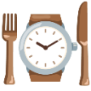

# 🍽️ Meal'o'Clock

> Know exactly when to eat, what to eat, and how much — personalised to your body and goals.

**[Try it live →](https://aaaansi.github.io/meal-timer/)**



---

## What is it?

Most diet apps focus on *what* you eat. Meal'o'Clock focuses on *when* — because research shows meal timing is just as important for energy, fat loss, sleep quality and muscle growth.

Enter your wake time, sleep time and goal. The app builds your personal meal schedule for the day, tracks what you eat, and learns your energy patterns over time.

---

## Features

**Smart Scheduling**
- Meal windows calculated from your actual wake/sleep times
- Automatically adjusts number of meals based on your eating window
- Exercise meals added when you work out (pre-workout, post-workout, pre-sleep protein)
- Adapts to goals: lose weight, more energy, better sleep, build muscle

**Nutrition Guidance**
- Daily calorie target using the Mifflin-St Jeor equation
- Macro targets (protein, carbs, fat) personalised to your weight and goal
- Protein targets based on bodyweight (1.2–2.4g/kg depending on goal)
- Food suggestions and avoid lists per meal, per goal
- Supports fitness tracker calorie data (Garmin, Fitbit, Apple Watch etc)

**Daily Tracking**
- Check off meals as you eat them
- Live calorie and macro progress bars
- Rate your energy and hunger after each meal
- Insights tab shows patterns over time

**History**
- 30-day compliance calendar
- Current and best streaks
- Good day counter (75%+ meals hit)

**Built Right**
- Works offline — installable as an app on your phone
- Remembers your settings between sessions
- Auto-updates every minute, detects date changes
- Dark and light mode
- No account needed, no data leaves your device

---

## The Science

Meal timing is based on two peer-reviewed studies:

- **Kerksick et al. (2017)** — ISSN Nutrient Timing Position Stand. Covers pre/post workout nutrition, protein distribution, pre-sleep casein protein and glycogen replenishment windows.

- **BaHammam & Pirzada (2023)** — Circadian rhythm and meal timing research. Covers eating window alignment, breakfast timing, late-night eating effects on sleep and metabolic health.

Calorie calculations use the **Mifflin-St Jeor BMR equation**, the most widely validated formula for resting energy expenditure.

---

## Install On Your Phone

1. Open the link in Chrome (Android) or Safari (iOS)
2. Tap the menu → "Add to Home Screen"
3. Done — works like a native app, fully offline

---

## Tech

Built with vanilla HTML, CSS and JavaScript — no frameworks, no dependencies, no backend.

```
Frontend   Vanilla JS (ES6+), HTML5, CSS3
Storage    localStorage (everything stays on your device)
Deploy     GitHub Pages
PWA        Service Worker + Web App Manifest
Security   Content Security Policy, input sanitisation
Tests      25+ unit tests covering core calculation logic
```

---

## Local Development

```bash
git clone https://github.com/aaaansi/meal-timer.git
cd meal-timer
```

Open `index.html` in your browser or use Live Server in VS Code.

No build step, no npm install, no configuration needed.

---

## Project Structure

```
meal-timer/
│
├── index.html          # App structure and views
├── style.css           # All styles including dark/light mode
├── manifest.json       # PWA manifest
├── sw.js               # Service worker for offline support
│
├── js/
│   ├── app.js          # App init, view management, event listeners
│   ├── calculator.js   # TDEE, BMR, fasting window calculations
│   ├── compliance.js   # Streak tracking, daily progress
│   ├── meals.js        # Meal building, food suggestions, descriptions
│   ├── mood.js         # Energy/hunger tracking, insights
│   ├── render.js       # All DOM rendering functions
│   ├── storage.js      # localStorage save/load
│   ├── tests.js        # Unit tests (run runTests() in console)
│   └── timeUtils.js    # Time math utilities
│
└── icons/
    ├── icon-192.png
    ├── icon-512.png
    └── mealoclockemoji.png
```

---

## Running Tests

Add the test script  temporarily to `index.html` before the closing `</body>`:
```html
<script src="js/tests.js"></script>
```

Then open the app in your browser, open the console and type:

```javascript
runTests()
```

You'll see a pass/fail report for all 25+ unit tests covering:
- Time conversion math
- Midnight rollover edge cases
- TDEE and BMR calculations
- Fasting window logic
- Dynamic meal building
- Compliance tracking

---

## Roadmap

- [ ] Browser notifications — meal reminders
- [ ] Share your schedule — generate a shareable link
- [ ] Wearable API — automatic sleep data sync
- [ ] Weekly insights report — Sunday summary email
- [ ] Custom domain — mealoclock.app

---

## References

1. Kerksick, C.M. et al. (2017). International society of sports nutrition position stand: nutrient timing. *Journal of the International Society of Sports Nutrition*, 14, 33.
   https://doi.org/10.1186/s12970-017-0189-4

2. BaHammam, A.S. & Pirzada, A. (2023). Timing Matters: The Interplay between Early Mealtime, Circadian Rhythms, Gene Expression, Circadian Hormones, and Metabolism. *Clocks & Sleep*, 5(3), 507–535.
   https://doi.org/10.3390/clockssleep5030034

3. Mifflin, M.D. et al. (1990). A new predictive equation for resting energy expenditure in healthy individuals. *American Journal of Clinical Nutrition*, 51(2), 241–247.

---

*Built as a personal project to learn web development and explore the science of meal timing.*
